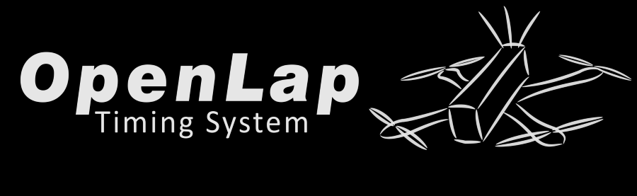
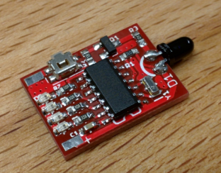
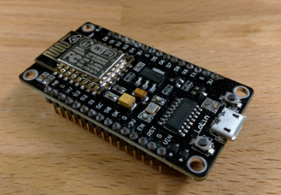

OpenLap is an open source IR laptimer for miniquad racing.

##Software

OpenLap is a cheap and easy to use system. It works with the famous [FPV Race Tracker Software by Andreas Neubauer](https://www.facebook.com/fpvracetracker/).

##Tags

OpenLap has developed own transponders. They are only 14*19mm and below 1g!
60 IDs are supported this time. On the transponders is a button and led indicators for easy change of the ID.

##Receiver

Instead of other timing hardware OpenLap is really simple!
Only one 7$ board and four 1$ Sensors are necessary to make it work.
It can be used wireless (with a small extra tool running on your pc) or wired over USB.
No setup has to be done. Once uploaded the software the hardware detects automatic the software used.

##How to start

1. Grab a transponder (build one yourselve or get one from official reseller (currently working on this..)). If you build one yourselfe here's [how to upload the software](docs/Transponder%20Update.md). 
2. Plug it in a free 5V source. Make sure you can draw enough current. Short pulses are over 100mA. Maybe an extra 47-100µF Elko on 5V rails is recommended if you notice some trouble. To set up your wanted ID follow [this guide](docs/Transponder.md).
3. To set up the receiver follow [this guide](docs/Receiver.md).

Now you're ready to use :)

_ToDo :_  
_- Wireless Usage_  
_- What you need_

##What's next

I'm working on a big update, but it's secret this time :P
Just kidding. I have to check if there is a chance of making this possibl what I plan. If it will be I will post some infos here ;)

##Weblinks

Main discussion about OpenLap is in following Facebook group :  
https://www.facebook.com/groups/1047398441948165/  
Most of the discussion are in german actual, but I will try to make an english version of my post in future. 

Also there is a website, but because of limited time the infos there are old...  
www.openlap.de

##Thanks for your interest in OpenLap
Always feel free to contact me, I will try to answer asap.
Any "professinal" help is welcome!
