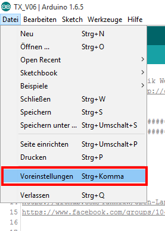
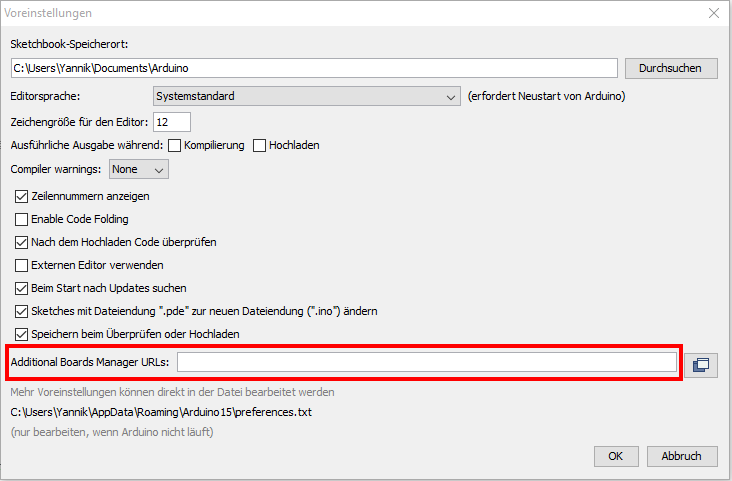
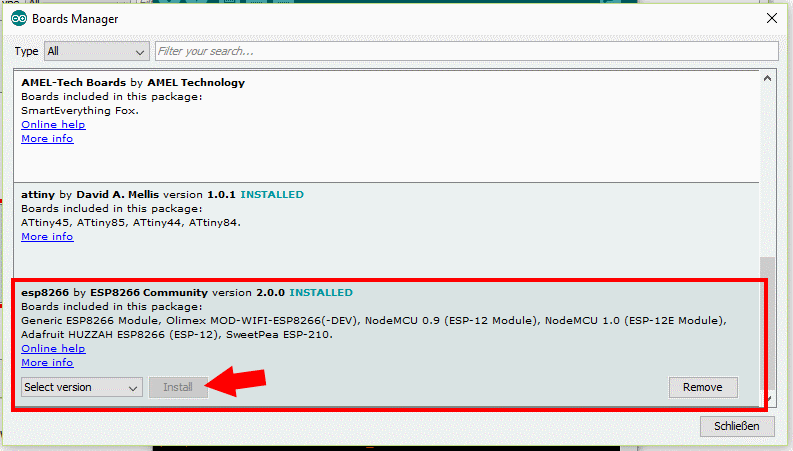
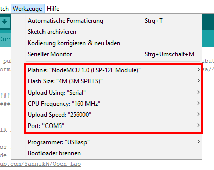
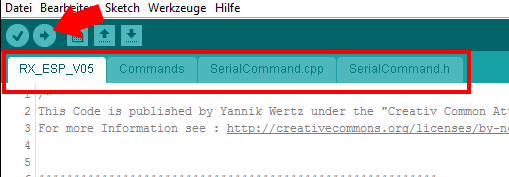
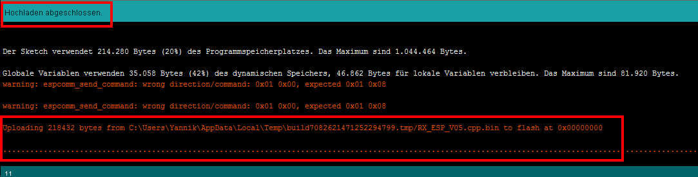

#Receiver 

1. Install ESP8266 support for Arduino
2. Configure upload options
3. Connect board and upload
4. Hardware Connection
5. Placing the Sensors

##1. Install ESP8266 support for Arduino

Note : You only have to do this once. If you already have ESP8266 support installed you can go to step 2.

#####Open preferences  



#####Add following URL to "Additional Boards Manager URLs" (use a comma to separate it from any URLs you've already added)  
````
http://arduino.esp8266.com/stable/package_esp8266com_index.json
````


#####Open Board Manager


#####Search for `esp8266 by ESP8266Community` and click on `Install`



Now you have successfully installed ESP8266 support for Arduino.

##3. Configure upload options

#####Select following board options  
````
Board : NodeMCU 1.0 (ESP-12E Module)
Flash Size : 4M (3M SPIFFS)
Upload Using : Serial
CPU Freqency : 160 Mhz
Upload Speed : 256000 (or 115200 if you get errors uploading)
Port : (Select you correct port - in my case COM5)
````



##4. Connect board and upload

Now connect your NodeMCU via USB.
To upload a sketch you have to performe following steps :

1. Press and hold the `Flash` button on the Board.
2. While holding `Flash` press the `Reset` button.
3. Release `Reset`first, then you can release `Flash`, too.
4. Now hit `Upload` in Arduino IDE.



Now you should see Arduio uploading and fill `.......` in the command line.  
While this the blue led on the NodeMCU should flash very fast.



Performing this is a bit tricky. Sometime it will not work, and the blue led doesn't begin flashing and arduino says `uploading` forever.

Just repeat the steps to try it again. Even I need two or three attempts to get it work.

##4. Hardware Connection

[ToDo]

##5. Placing the Sensors

[ToDo]
