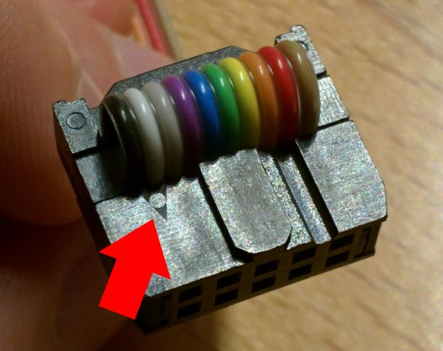
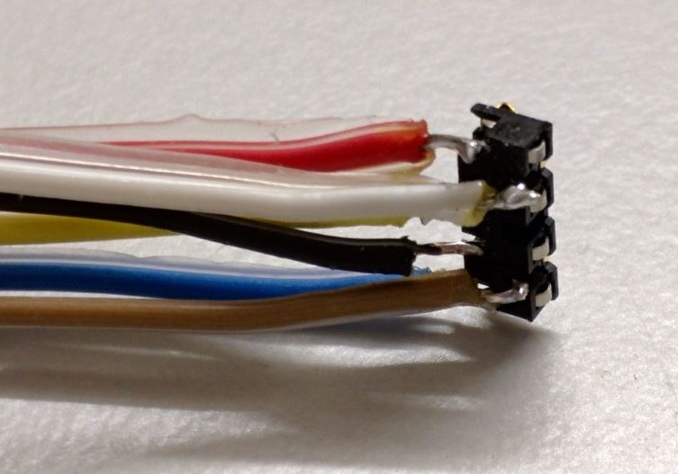
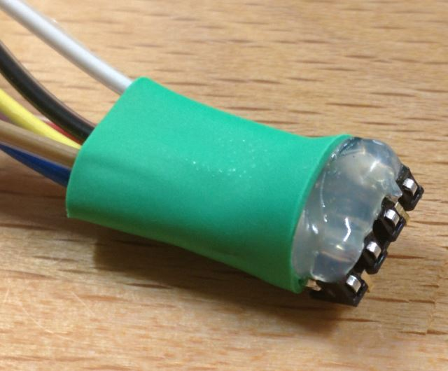
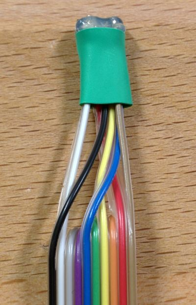
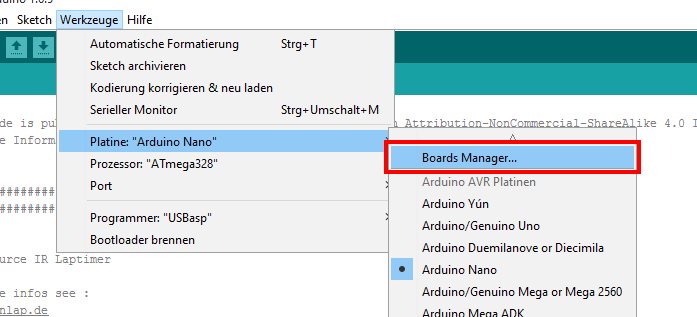
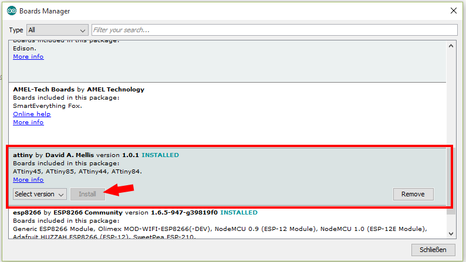
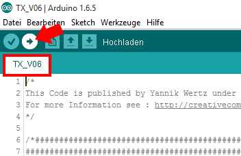
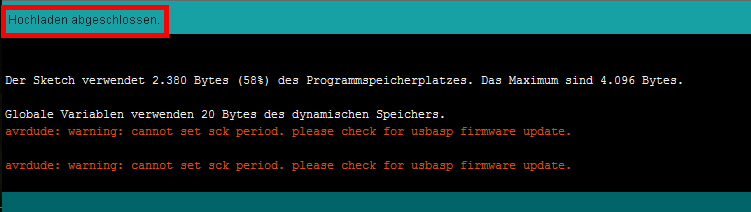

#Transponder Update

In this tutorial I will show you how to update your transponder if necessary.

1. Hardware needed
2. Install ATtiny support for Arduino
3. Configure upload options
4. Connect transponder and upload

Note : All pictures shows the german version of Arduino, but I think you will understand what to do ;)

##1. Hardware needed

1. [USBASP](http://www.ebay.de/itm/AVR-51-Programmer-Adapter-mit-10-Pin-Kabel-ATMega-ATTiny-USBASP-USBISP-/301687762189?hash=item463dfded0d:g:zrsAAOSw-vlVpJn8) (or - more complicated - [Arduino ISP](https://www.arduino.cc/en/Tutorial/ArduinoISP))
2. [AVX 6Pin Connector](http://www.mouser.de/Search/ProductDetail.aspx?R=009188006020062virtualkey58120000virtualkey581-009188006020062)
3. A transponder to update :P

If you use a Windows system you have to install the correct driver for the USBASP. You can find it [here](http://www.fischl.de/usbasp/). There's also a link with a description how to install this driver on Win 8 and above - this will cause problems because of driver signature.

Also you have to solder the 10 (or 6) pin cable correct to the 6 pins of connector.  
Connect the cable to the connector like showen in this picture : 

Red numbers are cable/pin number for normal 10 pin ISP connector (like the USBASP has). Green numbers are for 6 pin ISP connector.


If you dont know which cable is pin one, you can look at your ISP connector. On one side there's a small triangle. The side with the tiangle is pin one. (In this case black cable is pin one, white pins two, ...)


Your soldered connector should look like this :


For better usability I put some hot glue and shrink tube on the cables.
 


##2. Install ATtiny support for Arduino

Note : You only have to do this once. If you already have ATtiny support installed you can go to step 3.

#####Open preferences  


#####Add following URL to "Additional Boards Manager URLs" (use a comma to separate it from any URLs you've already added)  
````
https://raw.githubusercontent.com/damellis/attiny/ide-1.6.x-boards-manager/package_damellis_attiny_index.json
````


#####Open Board Manager



#####Search for `attiny by David A. Mellis` and click on `Install`



Now you have successfully installed ATtiny support for Arduino.

##3. Configure upload options

#####Select following board options  
````
Board : ATtiny
Processor : ATtiny44
Clock : 16MHz (external)

Programmer : USBasp (if you use the one shown above)
````


##4. Connect transponder and upload

#####Place programmer on the pcb

[ToDo picture]

#####Check if you have opened the newest TX sketch version and press upload



#####If you done all right command line should look like this (Upload completed)


